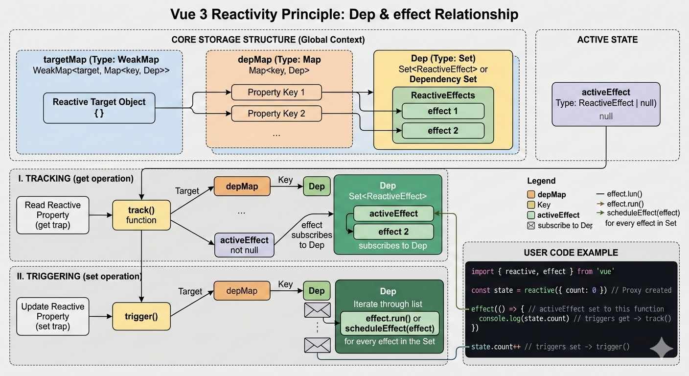

# Vue 2 响应式原理：Object.defineProperty
Vue 2 的响应式核心是利用 ES5 的 Object.defineProperty 方法，通过“数据劫持”结合“发布-订阅模式”来实现的。

核心分为三个大模块：

Observer（观察者）：在组件初始化时，Vue 会递归遍历 data 中的所有属性，并使用 Object.defineProperty 将它们全部转为 getter/setter。

Dep（依赖收集器）：每个属性都有一个专属的 Dep 对象。当模板编译或计算属性读取（触发 getter）这个属性时，Dep 会把当前的依赖（Watcher）收集起来。

Watcher（订阅者）：当你在代码中修改数据（触发 setter）时，setter 会调用该属性对应的 Dep，通知所有收集到的 Watcher 执行更新（比如重新渲染 DOM）。

具体代码查看：Learn/vue2/reactive.js
简化版原理代码片段：

```javascript
function defineReactive(obj, key, val) {
  const dep = new Dep(); // 每个属性一个依赖收集器
  Object.defineProperty(obj, key, {
    get() {
      dep.depend(); // 收集依赖
      return val;
    },
    set(newVal) {
      if (newVal !== val) {
        val = newVal;
        dep.notify(); // 通知更新
      }
    }
  });
}
```

Vue 2 响应式的致命痛点（也是 Vue 3 诞生的原因之一）：
无法检测对象属性的添加或删除：因为初始化时属性必须存在才能被 defineProperty 劫持。所以 Vue 2 提供了 $set 和 $delete 这样的 API 来打补丁。

无法监听数组的索引和长度变化：出于性能考量，Vue 2 没有对数组的每个索引进行劫持，而是采用了一种“Hack”的方式，重写了数组的 7 个变更方法（如 push, pop, splice 等）来触发视图更新。

性能损耗大：如果 data 是一个层级极深的庞大对象，Vue 2 在初始化时必须一次性递归遍历到底，把所有层级的属性都变成响应式，这会导致较慢的组件初始化速度和较高的内存占用。

# Vue 3 响应式原理：ES6 Proxy

代码路径：Learn/my-simple-vue

Vue 3 抛弃了 Object.defineProperty，全面拥抱了 ES6 的 Proxy（代理）和 Reflect（反射）。

Proxy 的降维打击：Proxy 不再是针对对象的某个具体属性进行劫持，而是直接对整个对象套上一层代理“外壳”。不论你是读取、设置、新增属性、删除属性，还是操作数组，统统都要经过这层外壳，从而被完美拦截。

依赖收集的重构：Vue 3 使用 track (追踪) 和 trigger (触发) 来替代原来的 Dep 逻辑，并在底层使用 WeakMap -> Map -> Set 的数据结构来高效管理所有的响应式依赖（副作用函数 effect）。

简化版原理代码片段：
```javascript
function reactive(target) {
  return new Proxy(target, {
    get(target, key, receiver) {
      track(target, key); // 收集依赖
      // 如果获取的属性值也是对象，这里才会继续返回代理对象（惰性代理）
      return Reflect.get(target, key, receiver); 
    },
    set(target, key, value, receiver) {
      const result = Reflect.set(target, key, value, receiver);
      trigger(target, key); // 触发更新
      return result;
    }
  });
}
```

# vue2 和 vue3 computed 实现原理
## vue2 computed 实现原理：
源码位置：vue/src/instance/state.ts initComputed

基于响应式(Object.defineProperty) + 惰性求值(dirty标记)的Computed Watcher
1.初始化initComputed，创建一个Computed Watcher
2.调用defineComputed，使用Object.defineProperty创建get访问器描述符，get：当调用该值时，会访问到响应式对象，则对象的dep会收集该Computed Watcher，当dirty为true时，重新计算value值，并标记dirty为false，如果dirty为false，则直接返回缓存值，最后还会调用depend让响应式对象的dep收集Render Watcher（如果有）
3.当依赖的响应式对象变化时，dep.notify通知所有Watcher调用update，Computed Watcher更新只会将dirty标记为true，当Render Watcher执行更新时，此时dirty为true，则重新计算value值

## vue3 computed 实现原理：
具体代码查看：Learn/my-simple-vue/computed.js

基于响应式(Proxy + reflect) + 惰性求值(dirty) + effect
const count = ref(10)
const newCount = computed(() => count.value * 2)
1.创建一个ComputedRefImpl实例，创建内部effect，传入fn，并设置scheduler，这个内部effect相当于一个桥梁，当count属性变化时，count的dep会触发内部effect的scheduler执行，scheduler一方面设置dirty为true，另一方面会trigger ComputedRefImpl实例dep中effect重新执行
2.调用get方法时，收集当前effect(activeEffect)放在dep中，若dirty为true，执行effect.run()获取值并缓存在_value中，若dirty为false，则直接返回_value


# vue2 和 vue3 watch 实现原理

## vue2 watch 实现原理：
源码位置：src/instance/state.ts initWatch
基于响应式(Object.defineProperty) + User Watcher
类型：{ [key: string]: string | Function | Object | Array }
1.初始化initWatch，调用createWatcher规范化参数，最终调用vm.$watch
2.依赖收集与更新：用户 Watcher 创建时会**立即执行一次** this.get()，以收集依赖。get() 方法将当前 Watcher 设为 Dep.target，然后执行 getter（即访问监听的数据），从而触发该数据属性的 getter，将当前 Watcher 添加到属性的 Dep 中。此后，当被监听的数据变化时，Dep 会通知所有订阅的 Watcher，包括这个用户 Watcher，用户 Watcher 执行时，它会重新求值（调用 this.get()），并与旧值比较，若值变化则触发回调
3.deep实现原理：当deep为true时，会递归访问对象的所有子属性，强制触发每个属性的get方法，从而使当前Watcher被所有深层属性的Dep收集


## vue3 watch/watchEffect 实现原理：
代码路径：Learn/my-simple-vue/apiWatch.js watch/watchEffect
基于ReactiveEffect实现
watch(source, callback, options)：侦听一个或多个响应式数据源，并在数据源变化时调用所给的回调函数。
watchEffect(source, options)：立即运行一个函数，同时响应式地追踪其依赖，并在依赖更改时重新执行
侦听器的源source，可以是一下几种：
1.一个函数
2.一个ref
3.一个响应式对象（默认deep为true）
4.以上类型组成的数组
options支持以下选项：
immediate(立即执行callback)、deep、flush、onTrack、onTrigger、once


flush，可选值：pre、post、sync，实现原理？
sync 是同步执行，当依赖发生变化时，会立即执行
pre 是组件渲染前执行，post 是组件渲染后执行，pre和post都是把任务放到微任务中(通过Promise实现)，执行顺序如下：
1.微任务开始
2.执行 Pre-flush 队列：执行 pre 类型的 watch
3.Vue 内部 Render & Patch：Vue 遍历虚拟 DOM，调用原生 DOM API（如 appendChild, setAttribute）来更新真实的 DOM 树。此时，内存里的 DOM 已经是最新的了！
4.执行 Post-flush 队列：执行 flush: 'post' 的 watch 回调
5.微任务结束
6.进入 Rendering Pipeline：浏览器计算样式（Recalculate Style）、布局（Layout）、最后进行 Paint（绘制）

## 为什么Vue2和Vue3 watch初始化时会立即执行一次？
因为只有初始化执行了，才能进行依赖收集，依赖更新后才会触发watcher执行回调
