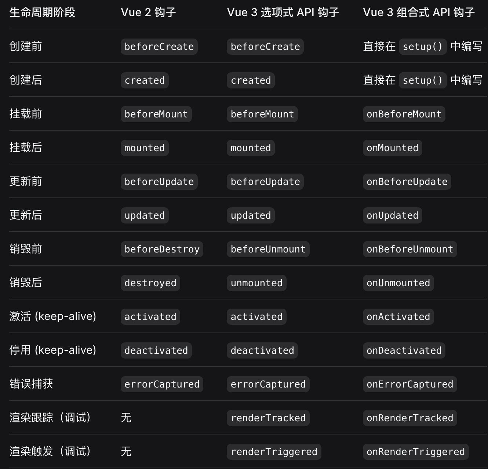

# 1.响应式原理相关

## Vue2 和 Vue3 响应式原理(包含computed/watch)
具体见 vue2/3响应式原理.md

## 1.1 Proxy替代defineProperty原因，解决什么问题，各自的局限性
defineProperty局限性：
1.无法监听对象的新增和删除，需要通过Vue.set和Vue.delete手动处理
2.无法监听数组的索引赋值及length变化，内部专门重写了 push/pop/unshift/shift/splice/sort/reverse 使得这些API方法具备响应式
3.不支持 Map/Set 数据类型
4.初始化性能开销大，首次需要递归遍历所有对象（包括深层嵌套对象），特别是对象庞大且层级且嵌套深，那么性能开销大

Proxy相比defineProperty的优势：
1.拦截更全面，包含13种拦截器，直接拦截的是对象而不是属性，所以可以监听对象的新增和删除
2.可以监听数组的索引赋值及length变化
3.支持 Map/WeakMap/Set/WeakSet 数据类型
  Map：可用过get拦截set/add/get/delete/clear/forEach/keys/values/has等操作
  Set：可用过get拦截add/delete/clear/forEach/keys/values/has等操作
2.对象首次创建Proxy性能更好，defineProperty首次会深度遍历创建对象，而Proxy有惰性代理机制，首次创建对象时，不会深度遍历创建子属性，只要当访问到时才创建

Proxy局限
1.浏览器局限性，Proxy是ES6语法，无法完全被polyfill，不支持IE11及更早的浏览器
2.无法代理基本数据类型，比如数字、字符串、布尔值等，可以定义Ref或者用对象包裹

## 1.2 为啥defineProperty方法不支持数组的索引修改或者长度修改呢？而Proxy是怎么解决的呢？
defineProperty方法
不支持数组索引修改原因：技术上可以实现，但是出于性能考虑不支持，理由是允许稀疏数组，如果为每个索引都创建get和set访问器描述符，那么性能开销极大
不支持修改长度：因为length的configurable为false，不可配置，所以没办法创建get和set访问器描述符

Proxy如何解决：
1.数组索引修改和数组length修改，都会触发set方法

# 2.生命周期相关

## vue2和vue3生命周期有什么不同

不同点：
1.vue3将vue2中destroy改名成了unmount
2.在组合式API中，setup合并了beforeCreate和created
3.vue3多了2个调试时用的钩子：渲染跟踪onRenderTracked、渲染触发onRenderTriggered

## 父组件的created和子组件的created哪个先执行，父组件的mounted和子组件的mounted哪个先执行？
初始化阶段生命周期调用顺序：父beforeCreate、父created、父beforeMount、子beforeCreate、子created、子beforeMount、子mounted、父mounted

当父组件发生更新时，生命周期调用顺序：父beforeUpdate、子updated、子beforeUpdate、父updated

当父组件销毁时，生命周期调用顺序：父beforeUnmount、子unmounted、子beforeUnmount、父unmounted

# 3.高级组件

## teleport原理，在SSR中有什么问题

## suspense原理

## transition原理

# 4.性能优化

## 5.1 实战：设计10万级数据的响应式优化方案（长列表优化）

# 5.其它

## reactive对象整个被替换，则触发哪个拦截器？
不会触发effect执行，会丢失响应式

## composition api优势，为什么更利于ts类型推断

## 组件之间如何通信

## nexttick实现原理，使用场景是什么？和watch flush关系？
nexttick实现原理：将回调放到微任务队列，等待组件渲染后执行该回调
Vue 2 为了兼容性，内部会做各种降级处理（Promise -> MutationObserver -> setImmediate -> setTimeout）。Vue 3 放弃了对老旧浏览器的支持，直接硬编码使用 Promise。
在一个微任务周期（Tick）内，Vue 的调度器会严格按以下顺序执行：
1.执行 flush: 'pre' 的任务（准备工作）。
2.执行渲染微任务（Render & Patch）（真正动 DOM）。
3.执行 flush: 'post' 的任务（善后工作）。
4.执行 nextTick 注册的回调（最后的确认）。
注意： 在 Vue 3 源码中，nextTick 的回调其实也是被推入了 postFlushCbs 队列中，所以它和 flush: 'post' 的 watch 基本处于同一个执行阶段。

使用场景：需要拿到更新后DOM
举例：比如表单自动聚焦：通过 v-if 控制一个 input 显示，显示后立即调用 input.focus()。如果不加 nextTick，input 还没在 DOM 里，调用会失败

为什么执行组件渲染微任务后，就可以操作dom呢？浏览器paint会立即渲染吗，还是等待屏幕刷新时机再渲染？
DOM 操作是同步的，但绘制（Paint）是异步的
当 Vue 的渲染微任务（Render & Patch）执行时，它底层调用的是浏览器的原生 API（如 appendChild、setAttribute、innerHTML 等）
当这些 API 被调用时，浏览器内部的 DOM Tree（数据结构） 会立即在内存中被修改，因为 DOM 树已经更新了，所以你紧接着执行 document.querySelector 或者访问 el.offsetHeight 时，浏览器引擎会基于内存中最新的 DOM 结构计算结果并返回给你
浏览器不会立即paint，会等待屏幕刷新时机再渲染，因为浏览器要攒着任务，等主线程空闲且屏幕刷新信号到来时，才统一进行像素绘制

## v-if v-for为什么不能共用