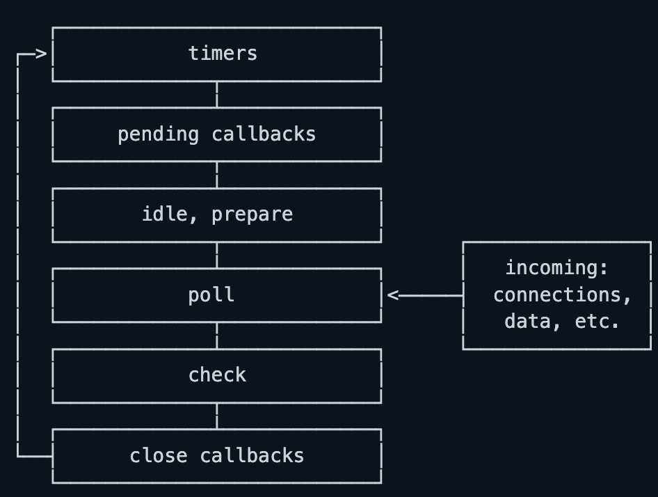

# 概念了解

## Call Stack 调用栈
- 定义：调用栈是一个数据结构，用来跟踪函数调用顺序，遵循先进后出原则。
每个函数调用都会创建一个栈帧（stack frame），栈帧包含了函数的参数、局部变量、this、返回地址、作用域链等信息。

# 浏览器 Event loop
- 定义：事件循环是浏览器协调主线程任务调度的核心机制。它是一个持续运行的循环进程，负责监听、调度和执行JavaScript运行时环境中的各种异步任务
- 作用：
  - 任务队列管理：协调宏任务（macro-tasks）、微任务（micro-tasks）和渲染任务（rendering tasks）的执行顺序
  - 非阻塞式执行：确保单线程环境下的异步操作能够顺利进行，避免I/O操作或网络请求阻塞主线程
  - 用户交互响应：保证高优先级任务（如用户输入）能够及时处理，维持页面响应性
  - 渲染帧同步：协调JavaScript执行与浏览器渲染的时机，实现流畅的视觉更新

# 完整执行流程图

开始事件循环迭代
    ↓
[宏任务阶段]
├─ 从任务队列取出一个宏任务
├─ 执行该宏任务同步代码
├─ 产生的微任务进入微任务队列
├─ 产生的宏任务进入任务队列
    ↓
[微任务阶段]
├─ 清空微任务队列（包括执行期间产生的新微任务）
    ↓
[渲染判断阶段]
├─ 检查是否达到渲染时机（一般来说每隔16.7ms渲染一次）
│  ├─ 是：执行requestAnimationFrame回调
│  ├─ 执行渲染管道：
│  │  1. 样式计算（Recalc Style）
│  │  2. 布局（Layout）
│  │  3. 执行 IntersectionObserver 回调（为什么在layout后paint之前？因为布局完就确定是否相交，paint前是因为有可能回调会修改DOM导致样式变化，这时浏览器会重新运行部分布局流程）
│  │  4. 执行 ResizeObserver 回调
│  │  5. 绘制（Paint）
│  │  6. 合成（Composite）
│  └─ 否：跳过渲染
    ↓
[空闲阶段]
├─ 检查是否有空闲时间
├─ 执行requestIdleCallback回调
    ↓
等待下一个宏任务...

# Node.js Event loop

官方文档：https://nodejs.org/zh-cn/learn/asynchronous-work/event-loop-timers-and-nexttick

6个阶段：

- timers：此阶段执行由 setTimeout() 和 setInterval() 调度的回调
- pending callbacks：负责执行被延迟到下一个循环迭代的 I/O 回调。
  核心作用包括：
  - 处理系统级 I/O 错误：这是最典型的用途。例如，如果 TCP socket 在尝试连接时收到了 ECONNREFUSED 错误，某些 Unix/Linux 系统会选择等待而不是立即报错。这个错误报告的回调就会被放入 pending callbacks 队列中执行。
  - 处理上一轮遗留的系统操作：并非所有的 I/O 回调都在 poll 阶段立即执行，某些由底层系统（libuv）调度的操作可能会推迟到此阶段处理。
- idle, prepare：仅在内部使用
- poll轮询(核心)：检索新的 I/O 事件；执行 I/O 相关的回调（几乎所有回调，除了关闭回调、由计时器调度的回调和 setImmediate() 之外），例如网络 I/O、文件 I/O；在适当的情况下，Node 会在此处阻塞，轮询设置了最长时间限制
- check检查：setImmediate() 回调在此处被调用，当 Poll 阶段空闲时，如果发现有 setImmediate 在排队，就会直接进入这个阶段
- close callbacks：一些关闭回调，例如 socket.on('close', ...)。

## poll 阶段的两个核心职责
poll 阶段有两个主要逻辑：

A. 如果 poll 队列不为空：
Event Loop 会同步地执行队列中的回调，直到队列清空，或者达到系统的硬性上限（防止该阶段无限执行导致后面阶段“饿死”）。

B. 如果 poll 队列为空：
这是 poll 阶段最聪明的地方，它会面临三个分支选择：
检查 setImmediate：如果脚本已调用 setImmediate()，Event Loop 会立即结束 poll 阶段，进入 check 阶段执行那些脚本。
检查定时器（Timers）：如果此时有定时器（setTimeout）已经到期，Event Loop 也会立即返回，按顺序绕回 timers 阶段执行回调。
阻塞等待：如果既没有 setImmediate，也没有到期的定时器，Event Loop 会在 poll 阶段停留（Block），等待新的 I/O 回调被加入队列。

## setImmediate vs setTimeout
如果在非I/O周期内执行，2个计时器的执行顺序是不确定的
然而这2个调用在一个I/O循环内，则setImmediate调度的回调总是先执行

```javascript
const fs = require('fs');

fs.readFile(__filename, () => {
  setTimeout(() => {
    console.log('timeout');
  }, 0);
  setImmediate(() => {
    console.log('immediate'); // 总是先执行
  });
});
```

## 优先级

同步代码/当前回调结束 -> 执行所有的process.nextTick -> 执行所有的Promise Microtasks -> 事件循环下一个阶段


# 微任务 microtask
优先级高

- Promise.then/catch/finally
- queueMicrotask
- process.nextTick(Node.js特有)
- MutationObserver 监听DOM树结构变化


# 宏任务 macrotask
优先级比微任务低

- script脚本
- setTimeout
- setIntervel
- setImmediate(Node.js特有)
- MessageChannel 消息通信
- I/O操作，例如文件读取，数据库操作、网络请求(XMLHttpRequest)等
- UI渲染(Rendering)
- 用户交互事件，例如鼠标点击click、键盘事件keydown、滚动事件scroll等

